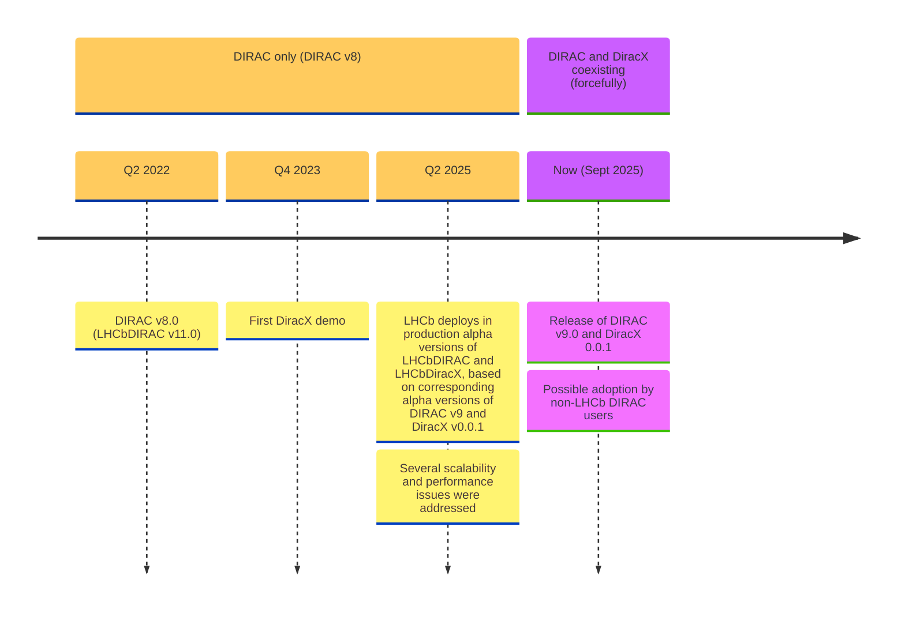
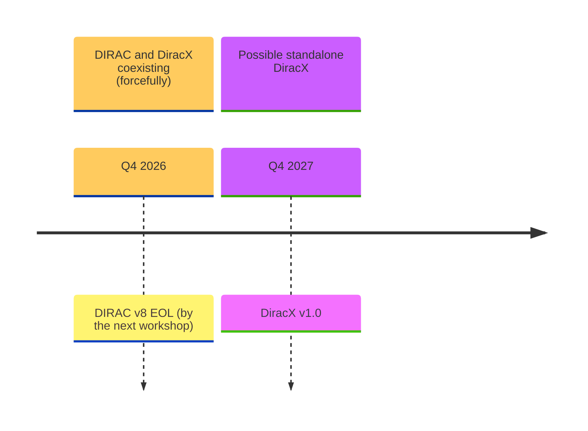
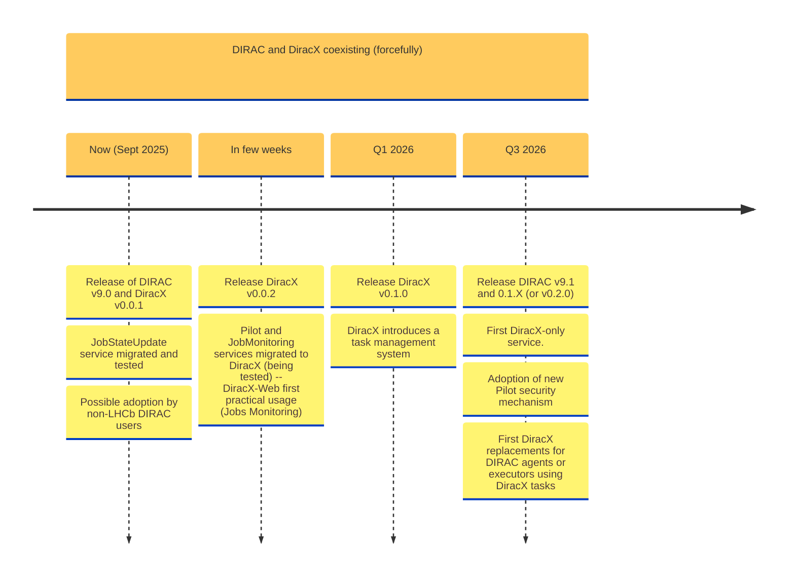

# LHCbDIRAC(+X)(+Web) status

**Federico Stagni** <Email v="federico.stagni@cern.ch" />

September 22nd 2025
__ <a href="https://indico.cern.ch/e/duw11" class="ns-c-iconlink"><mdi-open-in-new />117th LHCb Week (Beijing), Computing and Software Parallel Session</a>  

---
layout: top-title-two-cols
color: gray-light
align: c-lm-lm
title: intro
columns: is-4
---

:: title ::

# Background

:: left ::

- Last week we held, here in Beijing (but in IHEP), the 11th DIRAC Users' Workshop
- An occasion to meet other DIRAC(X) Users and to checkpoint on the status
- Theoretically LHCb is "yet another DIRAC user", but practically it is its main maintainer/developer

:: right ::

### *Andrei Tsaregorodstev:*


---
layout: section 
color: lime-light
---

The workshop was mostly focussed on the transition to DiracX:

<div style="display: flex; align-items: center; justify-content: center;">
    
    <span style="margin: 0 50px;">--></span>
    
</div>

This presentation is instead focussed on what are the news concerning LHCb.


---
layout: top-title-two-cols
color: gray-light
align: c-lt-lm
title: summary
---

:: title ::

# A timeline of what happened lately

:: left ::



:: right ::

- We migrated before data taking restarted, effectively with 1 week of downtime
  - largely, **not** because of DiracX: we "profited" also for making (too) many **optional** MySQL updates
- running in productions with alpha versions since
- finally we can now install LHCbDIRAC v12.0 (on DIRAC v9.0) and lhcbdiracx v0.0.1 (on diracx v0.0.1)
  - also lhcbdiracx-web v0.0.1


---
layout: top-title-two-cols
color: gray-light
align: c-lm-lm
title: Users-WhatsNew
---

:: title :: 

# What's new 

:: left ::

### DiracX brings updates for

- Users
- Administrators
- Developers

:: right :: 

### For Users:

<ul class="text-sm">
  <li><strong>Logging-in</strong> requires that you are previously registered in an IdP implementing OpenID Connect protocol
    <ul>
      <li>essentially this is the VOMS-&gt;IaM migration, which for LHCb we did more than a year ago</li>
    </ul>
  </li>
  <li>New <strong>Web app</strong></li>
  <li>Enriched and modern <strong>CLI</strong> (for the moment there are not many functionalities in there)</li>
  <li><strong>REST</strong> interface for programmatic usage (for advanced users -- but again, not much user-facing info to use)</li>
</ul>


---
layout: section
color: cyan
title: toV9-users
---

# (LHCb)DiracX for LHCb Users

As of now most of **LHCb Users** "do not yet need to know", as for the first version users' interactions will still be done via the DIRAC tools they know (and love?).

Still, there are a few update that would interest the most curious ones.


---
layout: top-title-two-cols
title: WebApp
color: gray-light
align: c-lm-lm
---

:: title ::

# DiracX brings with it a new Web App

:: left ::

We are (also) rewriting [the Web App](https://github.com/DIRACGrid/diracx-web) from scratch

Software stack:
- NextJS <devicon-nextjs-wordmark class="text-4xl align-middle inline-block mx-2" />
- Material UI <devicon-materialui class="text-3xl align-middle inline-block mx-2" />
- TypeScript <devicon-typescript class="text-3xl align-middle inline-block mx-2" />

:: right ::

### *Ryunosuke:*


---
layout: top-title
color: gray-light
align: c
title: LHCbDiracXWeb
---

:: title ::

# LHCbDiracX-web (a new LHCb DIRAC portal)
## credits to Ryunosuke!

:: content ::

**[lhcbdiracx.app.cern.ch](https://lhcbdiracx.app.cern.ch/)**

Apps:
- A not-yet-fully-functional Job Monitor app
- A "storage report" application: a visualisation tool for LHCb storage
- A bookkeeping application: a replacement for the old bookkeeping application with filtering capability. Work in Progress!
  - Search bookkeeping datasets by path elements
  - Browse results in a table or tree
  - To be extended with more features when backend performance stabilises


---
layout: top-title
title: screenshots
color: gray-light
align: c
---

:: title ::

# Screenshot of Storage Report

:: content ::


---
layout: top-title
color: gray-light
align: c
title: CLI
---

:: title ::

# CLI Interactions

:: content ::

- Logging in (using the `diracx cli`):

```bash
❯ dirac login lhcb
Logging in with scopes: ['vo:lhcb']
Now go to: https://lhcbdiracx.app.cern.ch/api/auth/device?user_code=XYZXYZXYZ
...Saved credentials to /home/fstagni/.cache/diracx/credentials.json
Login successful!
```

And being this a REST API, you can interact with it using standard tools

- E.g. using Python `requests`:

```python
import requests

requests.post('https://lhcbdiracx.app.cern.ch/some/route/', headers={'accept': 'application/json', 'Authorization': 'Bearer eyJhbG...', 'Content-Type': 'application/json'}, json=jdl)
```

- or even `curl`:

```bash
curl -X 'GET' \
  'https://lhcbdiracx.app.cern.ch/some/route/status?job_ids=8971' \
  -H 'accept: application/json' \
  -H 'Authorization: Bearer eyJhbG...'  | jq
```

---
layout: top-title-two-cols
color: gray-light
title: Web API
align: c-lm-lm
---

:: title ::

# (LHCb)DiracX Web API

:: left ::

DIRAC Web APIs with <devicon-fastapi-wordmark class="text-7xl align-middle inline-block mx-0"></devicon-fastapi-wordmark>

At **[lhcbdiracx.app.cern.ch/api/docs](https://lhcbdiracx.app.cern.ch/api/docs)**

Nicely documented thanks to Swagger.

:: right ::


---
layout: iframe-right
title: Client
url: https://diracx.diracgrid.org/en/latest/dev/how-to/client-generation/
class: Client
slide_info: false
color: gray-light
align: lm
---

# The DiracX Client

Since `FastAPI` includes built-in support for [OpenAPI](https://spec.openapis.org/oas/v3.0.3) specifications, the `client` can be generated by [autorest](https://github.com/Azure/AutoRest)

- several languages supported. Within the DiracX repo we include the python client
  - if you want to generate a client in another language (e.g. because your third-party application is developed in Java or Go), we can do it within lhcbdiracx


---
layout: section
color: cyan-light
title: WMS-Updates
---

# WMS updates

---
layout: top-title
align: c
color: gray-light
title: ARM
--- 

:: title ::

## ARM resources (from *Alexandre Boyer*)

:: content ::


---
layout: top-title
align: c
color: gray-light
title: CWL
--- 

:: title ::

## CWL: Proof of Concept (from *Alexandre Boyer*)

:: content ::


---
layout: top-title
align: c
color: gray-light
title: CWL_plan
--- 

:: title ::

## CWL: Plan (from *Alexandre Boyer*)

:: content ::


---
layout: section
color: cyan-light
title: Conclusions
---

# To conclude


---
layout: top-title-two-cols
align: cm-cm-lm
color: orange-light
columns: is-4
title: summary
--- 
:: title ::

# Summary

:: left :: 


:: right ::

- We have been running (LHCb)DiracX(-Web) in production since April
- It works!
  - but we relied heavily on the internal knowledge
- DiracX gives the possibility for easier interactions from LHCb users and applications 


---
layout: credits
color: navy
loop: true
speed: 1.0
title: credits/people
---


<div class="grid text-size-4 grid-cols-3 w-3/4 gap-y-10 auto-rows-min ml-auto mr-auto">
    <div class="grid-item text-center mr-0- col-span-3">
        <strong>People</strong><br> 
    </div>
    <div class="grid-item text-right mr-4 col-span-1">
        <strong>Current Developers, maintainers, supporters</strong>
    </div>
    <div class="grid-item col-span-2">
        Chris Burr <i>CERN</i><br/>
        Christophe Haen <i>CERN</i><br/>
        Alexandre Boyer <i>CERN</i><br/>
        Ryunosuke O'Neil (Wada) <i>CERN</i><br/>
        Federico Stagni <i>CERN</i><br/>
        Vladimir Romanovskiy <i>Cincinnati</i>
    </div>
</div>

&nbsp;
&nbsp;
&nbsp;

<div class="grid-item col-span-3 text-center mt-180px mb-auto font-size-1.5rem">
    <strong>Questions?</strong>
</div>


---
layout: section
color: cyan-light
title: Backup
---

# Backup

---
layout: top-title-two-cols
color: gray-light
align: c-lm-lm
title: Timeline-long
---

:: title ::

# In 1 year and more

:: left ::



<SpeechBubble position="l" color='amber' shape="round"  v-drag="[360,125,160,180]">
NB: **very** indicative guess, maybe not for everyone (e.g. not for LHCb).
</SpeechBubble>


:: right :: 

## **notes**

- There's a lot of guesswork in understanding how things will be in one year time, and even more in what will happen after


---
layout: top-title-two-cols
color: gray-light
align: c-lm-lm
title: Timeline
columns: is-8
---

:: title ::

# Timeline of the next year

:: left ::



:: right ::

- There are developments done by stagiare that could not be included in DiracX's first release, so v0.0.2 is close
- DiracX v0.1.0 will bring "tasks", for replacing DIRAC's *agents*, *executors*, and the RMS machinery (the *RequestExecutingAgent*)
- We will need a DIRAC v9.1 because there will be database changes (some PRs already in *draft*)

---
layout: section
color: cyan
title: toV9-administrator
---

# From DIRAC v8 to v9+0.0.1 : **Administrators**

---
layout: top-title
color: gray-light
align: c
title: IT
---

:: title ::

# Standing on the shoulders

:: content ::

CERN IT provides all needed services:

- MySQL 8.4 [on-demand](https://dbod-user-guide.web.cern.ch/)
- [IaM](https://lhcb-auth.cern.ch/)
- [Opensearch](https://opensearch.docs.cern.ch/)
- [Openshift](https://paas.docs.cern.ch) for hosting k8 projects
- [Object storage](https://clouddocs.web.cern.ch/object_store/index.html) compatible with S3, built upon Ceph
- [Grafana instance](https://monit.docs.cern.ch/grafana/description/) 
- OpenTelemetry (full support in progress)

Each of the above services come its with own monitoring (and sometimes we have look at it)

---
layout: top-title
color: gray-light
align: c
title: openshift
---

:: title ::

# OpenShift deployment

:: content ::


---
layout: top-title
color: gray-light
align: c
title: openshift-dev
---

:: title ::

# OpenShift deployment/2

:: content ::


---
layout: top-title
color: gray-light
align: c
title: monitoring
---

:: title ::

# monitoring

:: content ::


---
layout: top-title
color: gray-light
align: c
title: OTEL
---

:: title ::

# infrastructure monitoring via OpenTelemetry

:: content ::


---
layout: top-title
color: gray-light
align: c
title: OTEL2
---

:: title ::

# infrastructure monitoring via OpenTelemetry/2

:: content ::


